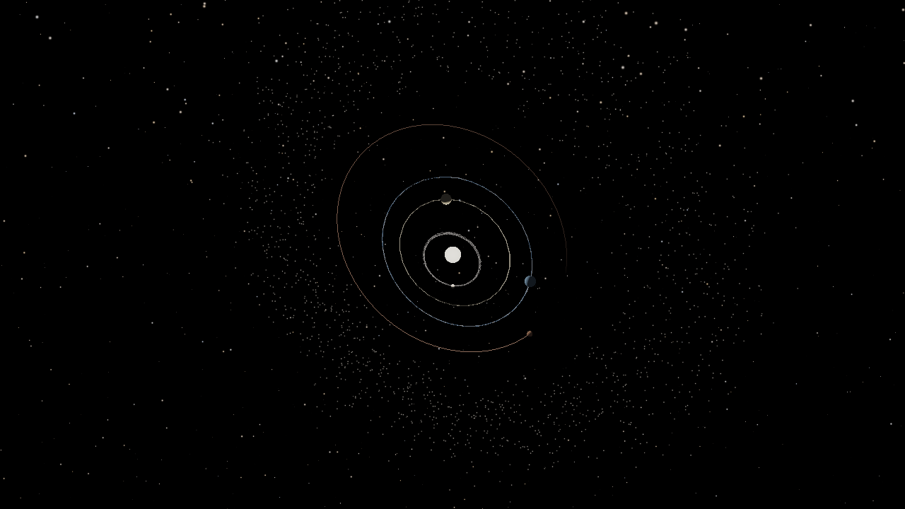
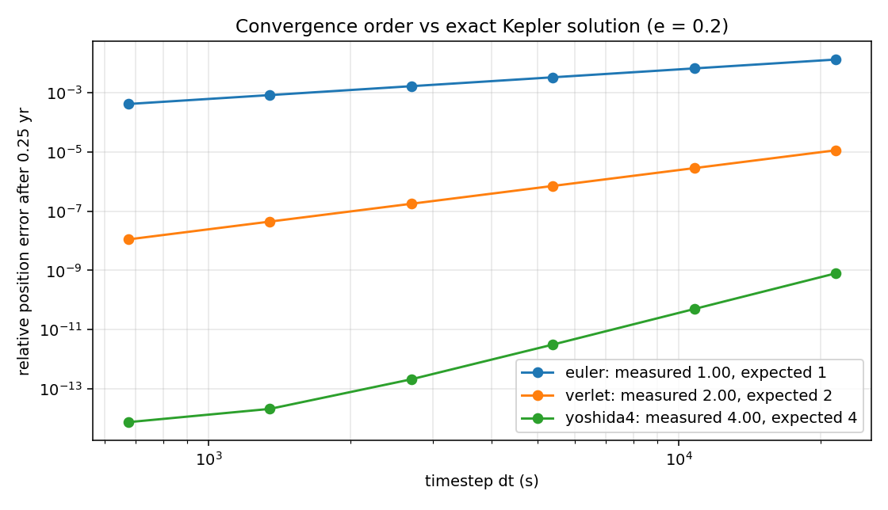
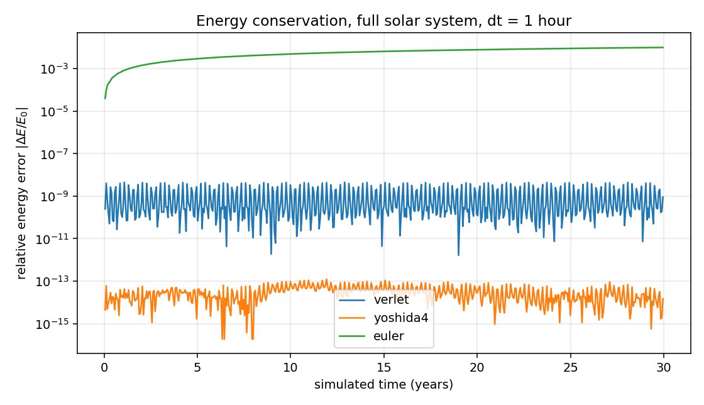
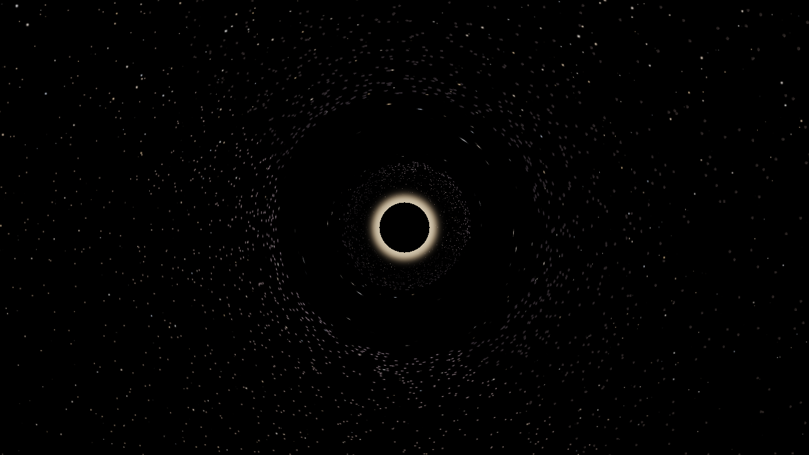

# Cosmos — a validated N-body gravitational simulator with real-time 3D rendering

A gravitational N-body simulator written in Python + NumPy, with a real-time
OpenGL renderer capable of displaying scenes spanning fifteen orders of
magnitude — from a 6,000 km planet to a 4.5-billion-km orbit — without
precision artifacts.

The emphasis is on **verified correctness**. Every physical claim made here is
checked numerically by a reproducible validation suite, not asserted.



---

## Headline results

All produced by `python -m cosmos.validation.run_all`.

| Test | Result |
|---|---|
| Orbital periods from J2000 elements | worst-case error **0.06 %** across all 8 planets |
| Integrator convergence order (vs exact Kepler) | Euler **0.998**, Verlet **2.001**, Yoshida-4 **4.000** (theory: 1, 2, 4) |
| Energy conservation, 30 yr, dt = 1 h | Verlet **4.5 × 10⁻⁹** bounded · Yoshida-4 **1.2 × 10⁻¹³** · Euler **1.0 × 10⁻²** and growing |
| Mercury perihelion precession (1PN) | **+42.91″/century** vs Einstein's **+42.98″/century** — 0.2 % agreement |
| Test-particle optimisation | **1000×** faster than direct summation at N = 8192 |

The Mercury result is the one worth dwelling on: with the relativistic term
switched off the same code gives −0.005″/century, so the effect demonstrably
comes from the physics and not from accumulated integration error.





---

## Install and run

```bash
pip install -r requirements.txt
python -m cosmos --scene solar
```

Scenes: `solar` (real J2000 solar system + asteroid belt), `sgra`
(Sagittarius A* with an accretion disk), `binary` (two stellar-mass black
holes with a circumbinary disk).

```bash
python -m cosmos --scene sgra
python -m cosmos --scene solar --bodies 8000     # bigger asteroid belt
python -m cosmos.validation.run_all              # regenerate all the numbers
python -m cosmos.tools.offscreen --scene solar --frames 60   # headless PNGs
```

### Controls

| | |
|---|---|
| `W A S D` `Space` `Shift` | fly · hold `Ctrl` to boost |
| mouse | look · `Tab` releases the cursor |
| scroll | flight speed |
| `F` / `V` | cycle focus body · `C` toggle follow · `R` reset view |
| `,` / `.` | time scale · `P` pause |
| `[` / `]` | planet visual scale |
| `G` | toggle relativistic correction |
| `I` | cycle integrator (watch Euler destroy the solar system) |
| `T` `Y` `H` | trails · starfield · help |

---

## How it works

### Physics

Everything is **SI units in float64**. No scaled units, no mixed systems.

**Gravity** is the vectorised direct sum

```
a_i = G Σ_j m_j (r_j − r_i) / |r_j − r_i|³
```

built as one `einsum` over an (N, N, 3) array, automatically switching to a
blocked version above N = 1024 where the temporaries stop fitting in cache.

**Close encounters** use a separation *floor*, `max(r², r_contact²)`, rather
than the textbook Plummer softening `r² + ε²`. This matters more than it
looks: Plummer softening perturbs the force at *every* distance, and with ε
set to the Sun's radius it drives a spurious −63,000″/century precession in
Mercury — 1500× the relativistic signal we are trying to measure. The floor
is exactly Newtonian outside contact and only caps the force where bodies
overlap.

**Integration** uses symplectic methods, which conserve a quantity very close
to the true energy, so error oscillates rather than accumulating:

- `velocity_verlet` — 2nd order, one force evaluation per step (default)
- `yoshida4` — 4th order, three evaluations, composed so the 3rd-order error
  terms cancel exactly
- `euler` — included so you can watch it fail

**Relativity** adds the 1PN correction `−(GM/r²)·3h²/(c²r²)`, which is what
makes orbits precess. Tiny for Mercury; dominant near a black hole.

**Test particles.** Asteroids and disk particles are given zero mass: they
feel gravity but don't exert it. A belt asteroid is ~10⁻¹² of Earth's mass,
so its pull on anything else sits below float64 rounding error. That turns an
O(N²) problem into O(N·M) with M ≈ 10 — a 1000× reduction at N = 8192,
obtained from physics rather than from a coding trick.

**Collisions** merge bodies inelastically, conserving mass and momentum.
Black holes absorb anything crossing their event horizon.

### Rendering

**Camera-relative coordinates.** The GPU works in float32 (~7 significant
digits). Neptune at 4.5 × 10¹² m would resolve to the nearest ~300 km and
visibly tear apart. So `body − camera` is computed on the **CPU in float64**
and only the small relative vector is uploaded. The view matrix is therefore
rotation-only — the translation already happened, in double precision.

**Logarithmic depth buffer.** A standard depth buffer spends over 90 % of its
precision in the nearest few percent of the near–far range. With far = 10¹⁴ m
everything beyond a few kilometres collapses to one value. Writing `log2(w)`
instead distributes precision uniformly per order of magnitude. Two lines in
the vertex shader, one in the fragment shader.

**Sphere impostors.** Each body is **four vertices** — one camera-facing quad.
The fragment shader solves the ray/sphere intersection analytically per pixel,
producing a mathematically perfect sphere at any zoom with correct per-pixel
normals and depth. This is what makes tens of thousands of bodies affordable.

**Lighting** is Lambert's cosine law with inverse-square falloff from the
actual stars in the simulation, normalised so a solar-luminosity star at 1 AU
gives irradiance 1.0. Planetary **phases** — crescent Venus, gibbous Mars —
emerge from correct orbital geometry with no special-case code. Stars get
limb darkening.

**Level of detail.** Bodies subtending less than ~1.4 px skip the sphere
solve entirely and render as blended points. In a typical asteroid-belt view
that is the overwhelming majority of them.

**Gravitational lensing** (`sgra`, `binary`) is a screen-space post-process
applying Einstein's deflection `α = 4GM/c²b = 2r_s/b` — exactly twice the
Newtonian value, which is what the 1919 eclipse expedition measured. Rays
with impact parameter below `b_crit = (3√3/2)·r_s ≈ 2.598 r_s` are captured,
producing the **shadow** — noticeably larger than the event horizon itself.
The bright rim just outside is the **photon ring**. Inside the Einstein
radius the lens equation goes negative, which is not an error: that is the
inverted **secondary image**, and letting the sign flow through reproduces it
for free.



---

## Layout

```
cosmos/
  physics/
    constants.py      SI constants, Schwarzschild/ISCO/Hill radii
    bodies.py         struct-of-arrays body store, energy & momentum diagnostics
    gravity.py        direct sum, blocked sum, test-particle path, 1PN term
    integrators.py    velocity Verlet, Yoshida-4, Euler
    kepler.py         orbital elements <-> state vectors, Kepler solver
    simulation.py     the clock: forces, stepping, collisions, diagnostics
  engine/
    camera.py         fly camera, view/projection matrices, log-depth coefficient
    shaders.py        all GLSL, commented
    renderer.py       culling, instancing, the frame
    sky.py            blackbody colour, procedural starfield
    trails.py         O(1) ring-buffer orbit history
    hud.py            text overlay
    app.py            window, input, main loop
  scenes/
    solar_system.py   real J2000 elements for all 8 planets + Moon + belt
    black_holes.py    Sagittarius A*, binary black holes
  validation/
    run_all.py        the five tests above, with plots
  tools/
    offscreen.py      headless rendering to PNG (no display required)
```

---

## Known limitations

Stated plainly, because knowing where your model breaks is part of the work.

- **Lensing is a weak-field screen-space approximation.** It reproduces the
  shadow, photon ring, Einstein ring and secondary image, but it deflects the
  already-rendered frame rather than integrating null geodesics of the
  Schwarzschild metric per pixel. Accurate to a few percent outside ~5 r_s;
  qualitative inside that.
- **Relativity is 1PN only.** Correct for perihelion precession and orbital
  dynamics; no frame dragging (Kerr), no gravitational-wave inspiral.
- **No general O(N log N) tree.** The test-particle split handles the intended
  scenes efficiently, but a genuine star cluster where every body matters
  still costs O(N²). A Barnes–Hut octree is the natural next module.
- **Accretion disks are ballistic.** Pure gravity, no gas pressure, viscosity
  or magnetohydrodynamics, so no real accretion — only orbital shear.
- **Planet radii are visually exaggerated** by default (`[` / `]` to change).
  Physics always uses true radii; only the drawn size is scaled. At true
  scale Earth is 0.04 px wide from 1 AU.

## Natural extensions

1. **Barnes–Hut octree** — O(N log N), takes this to ~10⁶ bodies.
2. **Numba or CuPy kernels** for the force loop.
3. **Validation against JPL Horizons** — integrate from J2000 and compare to
   NASA's measured ephemerides. The strongest possible external check.
4. **Lyapunov exponent measurement** — perturb one body by a metre, run two
   simulations, measure the divergence rate, recover the solar system's
   ~5–10 Myr predictability horizon.
5. **Full geodesic ray tracing** for the black holes.

## Requirements

Python 3.10+, `numpy`, `pygame`, `moderngl`; `matplotlib` and `pillow` for
the validation and headless tools. Needs an OpenGL 3.3 core profile.
