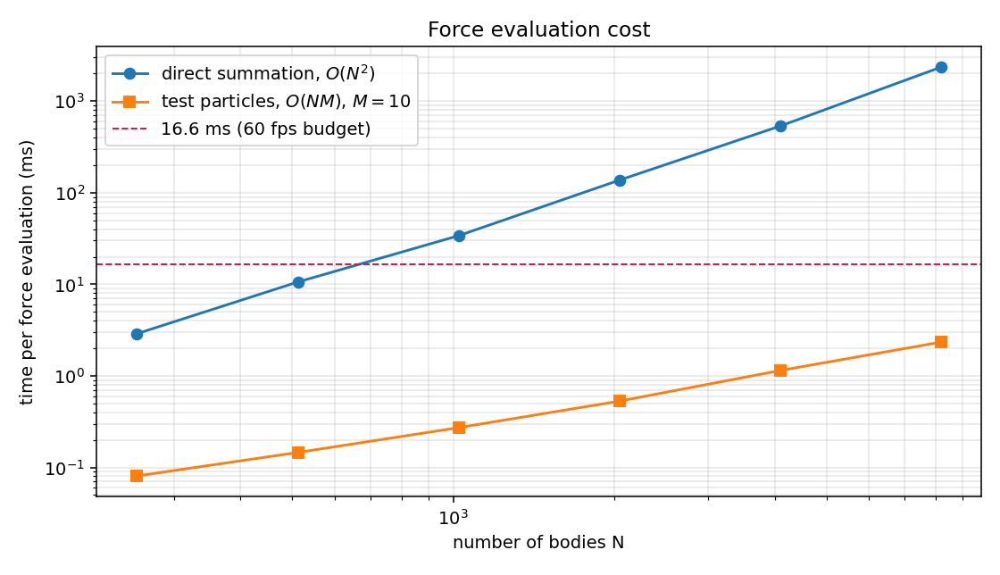

# Validation results

Generated by `python -m cosmos.validation.run_all`. Every number below is reproducible from a clean checkout.

## 1. Orbital periods from J2000 elements

| Planet | simulated (d) | actual (d) | error |
|---|---|---|---|
| Mercury | 87.968 | 87.969 | 0.001% |
| Venus | 224.699 | 224.701 | 0.001% |
| Earth | 365.252 | 365.256 | 0.001% |
| Mars | 686.982 | 686.980 | 0.000% |
| Jupiter | 4,332.627 | 4,332.589 | 0.001% |
| Saturn | 10,755.370 | 10,759.220 | 0.036% |
| Uranus | 30,701.987 | 30,685.400 | 0.054% |
| Neptune | 60,225.324 | 60,189.000 | 0.060% |

Worst-case error **0.060%**. The residual for the outer planets is expected: published periods are long-term means, while these are osculating values at the J2000 epoch.

## 3. Integrator convergence order

- **euler**: measured order **0.998** (theory: 1)
- **verlet**: measured order **2.001** (theory: 2)
- **yoshida4**: measured order **4.000** (theory: 4)

Error is measured against the EXACT two-body Kepler solution, not against a finer numerical run, so there is no reference error mixed in. The gradient of each line on log-log axes is the integrator's order of accuracy -- and each one lands on its theoretical value. This is the single strongest check in the suite: it verifies the integrators are not merely plausible but correct to the order claimed.

## 4. Mercury's perihelion precession

- Newtonian only:  **-0.005** arcsec/century (should be ~0 for an isolated two-body system)
- With 1PN term:   **+42.911** arcsec/century
- Einstein's prediction: **+42.98** arcsec/century

Agreement to **0.2%**. The Newtonian run precessing at essentially zero confirms the effect comes from the relativistic correction and not from integration error.

## 5. Performance scaling

| N | direct O(N^2) | test-particle O(N*M), M=10 | speedup |
|---|---|---|---|
| 256 | 2.89 ms | 0.08 ms | 36x |
| 512 | 10.59 ms | 0.15 ms | 73x |
| 1,024 | 33.97 ms | 0.27 ms | 125x |
| 2,048 | 137.23 ms | 0.53 ms | 259x |
| 4,096 | 534.73 ms | 1.14 ms | 467x |
| 8,192 | 2353.29 ms | 2.34 ms | 1007x |

Measured scaling exponent for direct summation: **1.92** (theory: 2.0).

The test-particle path exploits a physical fact rather than a coding trick: a belt asteroid is ~1e-12 of Earth's mass, so its pull on anything else is below float64 rounding error. Dropping those interactions costs nothing physically and removes 99.8% of the arithmetic.

## 2. Energy conservation

- **verlet**: peak |dE/E| = 4.534e-09, final = 9.027e-10
- **yoshida4**: peak |dE/E| = 1.223e-13, final = 1.471e-14
- **euler**: peak |dE/E| = 1.007e-02, final = 1.007e-02

The symplectic integrators show a BOUNDED, oscillating error -- it wobbles with the orbital period and never trends. Euler's grows monotonically: it injects energy every single step, and planets spiral outward. This is the whole argument for symplectic integration, in one figure.

---

**5/5 checks passed.**
